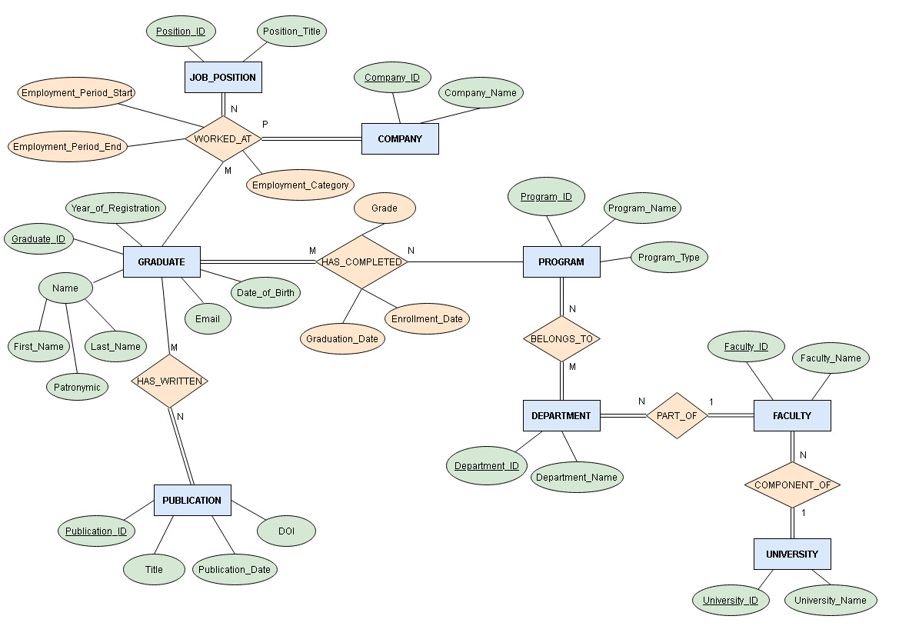
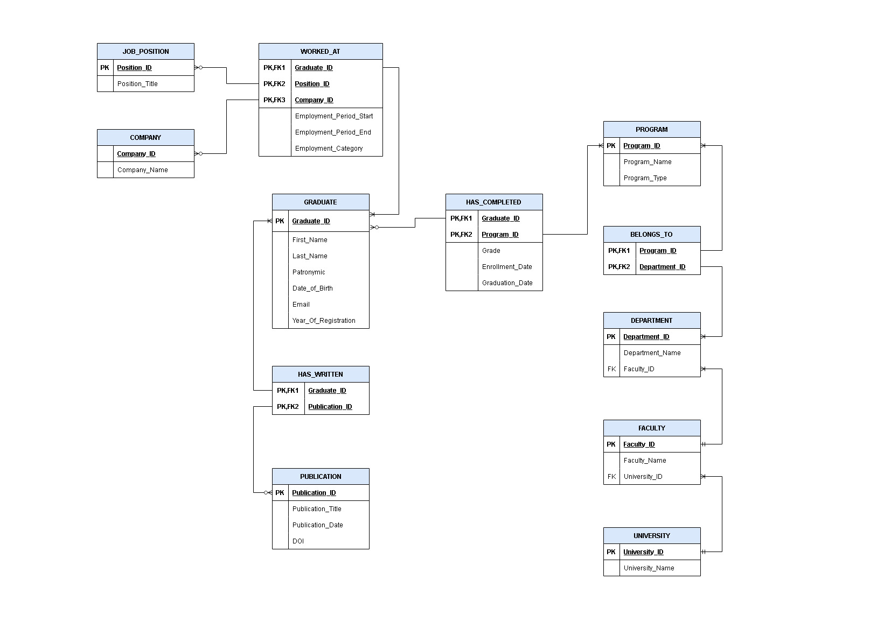

# Relational Database Design

## Project Overview

This project presents the design of a relational database for an alumni management system, developed as part of the postgraduate course **Data Management for Relational and Nonrelational Databases** at the University of Piraeus.  
The project focuses on the conceptual and logical design of the database, including an Entity-Relationship Diagram (ERD) and a detailed relational schema.

## Features

- Comprehensive modeling of alumni data, including graduates, academic programs, departments, faculties, universities, job positions, companies, and publications.
- Implementation of various relationships: **one-to-many, many-to-many (junction tables), and a ternary relationship** (three-way relationship) for modeling complex real-world associations.
- Clear representation of entities, attributes, primary and foreign keys.

## Entity-Relationship Diagram (ERD)

The ERD visually presents the entities, their attributes, and the relationships between them, including a ternary (three-way) relationship.  
**Total (mandatory) and partial (optional) participation of entities in relationships is explicitly indicated in the ERD, demonstrating a deeper understanding of conceptual data modeling principles.**

## Relational Schema

The relational schema illustrates the normalized structure of the database tables, primary keys, and foreign key constraints.

## Technologies Used

- Database design: Microsoft SQL Server Management Studio  
- Diagram creation: draw.io (diagrams.net) 

## Author

Georgia Papanikolopoulou  
MSc in Information Systems and Services, University of Piraeus

