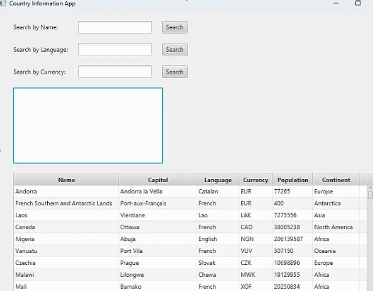

# Country Information App

The Country Information App is a JavaFX-based application that enables users to search for country information by name, language, or currency. The application displays the results in a table with details such as capital, currency, language, population, and continent.

The project demonstrates the use of JavaFX for GUI development and Java for backend operations. The app interacts with a REST API (countries-info) and displays the results in a graphical table format.

## Features

- **Country Search:** Retrieve country information based on name, language, or currency.
- **GUI:** Built using JavaFX, the graphical user interface allows users to interact with the country information using input fields and displays the results in a neatly organized table.
- **REST API Integration:** Utilizes the external REST API (countries-info) to retrieve country data. JSON data is fetched and displayed in a user-friendly format.
- **Table Display:** Displays the results in a JavaFX table, with columns for name, capital, currency, language, population, and continent.
- **Error Handling:** Implemented error handling to ensure a smooth user experience, with meaningful error messages displayed for API communication or network issues.

## Technologies Used

- **JavaFX:** For building the GUI of the application.
- **Spring Boot:** For managing backend functionality, including API calls and data handling.
- **Maven:** For project management and build automation.
- **Lombok:** For reducing boilerplate code (e.g., getters, setters, constructors).
- **JUnit and Mockito:** For unit testing and ensuring the correctness of the application's functionality.

## GUI Features

- **Search by Name, Language, and Currency:** Users can input a country's name, language, or currency into the respective search fields and press the "Search" button to display relevant information.
- **Table Display:** The country data is retrieved from the API and displayed in a table format, showing the Name, Capital, Language, Currency, Population, and Continent of each country.
- **Recent Searches:** A list of recent searches is maintained and displayed in a ListView component. Users can click on a previous search to rerun the query.



## Installation and Setup

### Prerequisites:

- **Java 17:** Make sure you have JDK 17 or higher installed on your system.
- **JavaFX SDK:** Ensure that the JavaFX SDK is correctly configured in your environment.
- **Maven:** Install Maven for dependency management and project building.

### Building the Project:

1. Clone the repository:

```bash   
   git clone https://github.com/Geo-ppl/Master-Projects.git
 ```

2. Navigate to the project directory:
    
```bash  
   cd Master-Projects/Java-OOP/Countries-API-Java
  ```

3. Build the project using Maven:
    
```bash  
   mvn clean install
```

### Running the Application:

#### Option 1: Using an IDE (e.g., Eclipse):
- Run the application as a Java application directly from the IDE.

#### Option 2: Running the JAR File:
- Navigate to the directory where the JAR file is located and use the following command in the terminal:

```bash
java -jar countries-fx-1.0-SNAPSHOT-jar-with-dependencies.jar
 ```

## Authors:  
- Georgia Papanikolopoulou - MSc in Information Systems and Services, University of Piraeus.
